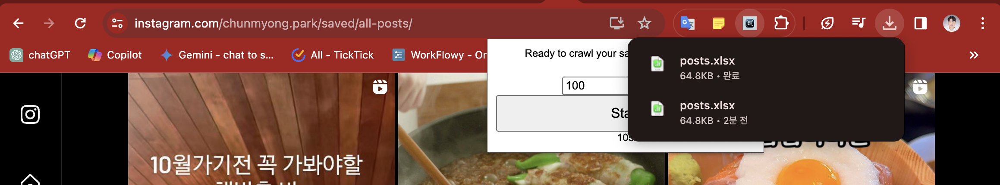

# insta_saved_post_crawl

**이 크롤러는 개인적으로 활용하기 위해서 개발한 것으로 보안상 위협적일 수 있는 구현을 포함합니다. 무단 배포 및 수정을 철저하게 금지합니다.**

## 1. download repository as a zip file

---

## 2. unzip downloaded zip file like below

---

## 3. install chrome extension by loading unziped directory

### 3-1. access to `chrome://extensions/`

### 3-2. enable 개발자(developer) mode

### 3-3. install chrome extension

### 3-4. pin `Instagram Saved Posts Crawler` extension to top of the chrome

---

## 4. move to https://www.instagram.com/<user_id>/saved/all-posts/

-   you need to replace <user_id> to your instagram user id

---

## 5. set maximum number of posts you want to capture and click start

-   **크롤링 도중에는 크롬 탭을 바꾸지 마세요. 크롤링이 멈출 수 있습니다**
-   **스크롤 문제나, 인터넷 문제로 아직 max값이 차지 않았는데 크롤링이 끝났다면, 다시 Start 버튼을 누르면 이전에 저장한 것을 유지하고 다음 크롤링을 진행합니다**
-   **크롤링 도중에 중간 결과물을 한번 저장하고 싶다면 SaveManually 버튼을 누르면 중간 결과물을 저장합니다.**
-   **만약 스크롤이 끝났는데 다운로드 창이 뜨지 않는 경우에도 SaveManually 버튼을 눌러주세요. 지금까지 크롤링한 결과물을 저장하실 수 있습니다**

## 6. check downloaded file from extension

---

## 7. drop-down excel file into blog to update database

TODO

---

# Question?

-   cmpark0126@gmail.com
