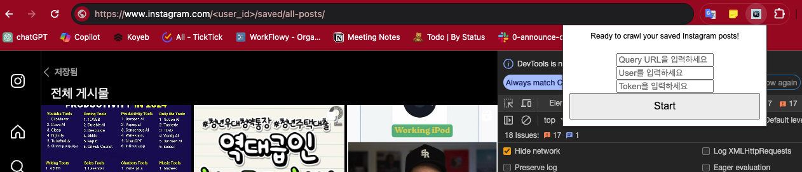
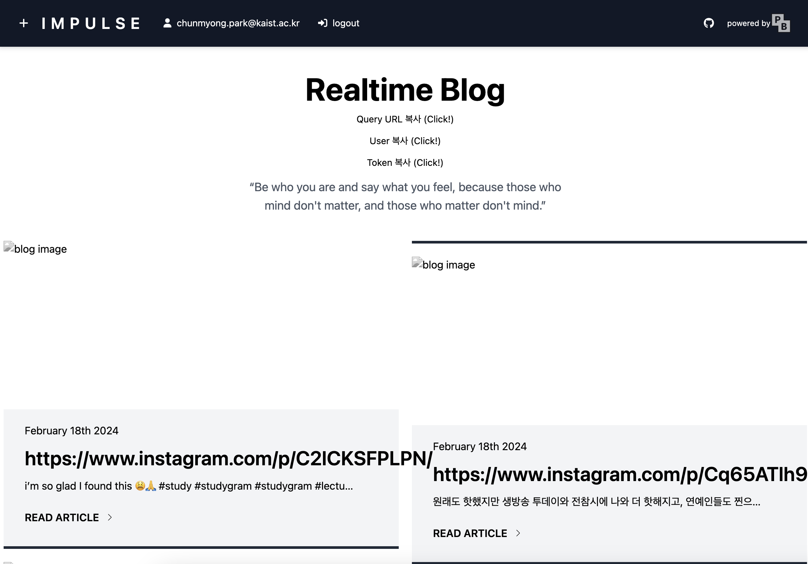

# insta_saved_post_crawl

## download repository as a zip file

## unzip downloaded zip file like below

## install chrome extension by loading unziped directory

### access to `chrome://extensions/`

### enable 개발자(developer) mode

### install chrome extension

### pin `Instagram Saved Posts Crawler` extension to top of the chrome

## move to https://www.instagram.com/<user_id>/saved/all-posts/

-   you need to replace <user_id> to your instagram user id

## copy query url, user, token from blog main page and paste it to extension, and click start

## check whether blog is updated

# Question?

-   cmpark0126@gmail.com
