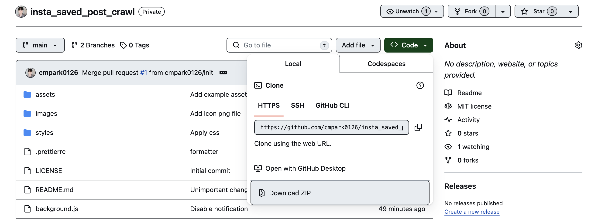
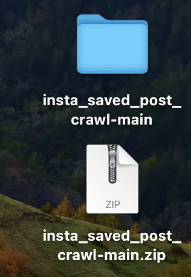
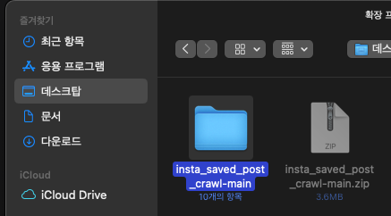
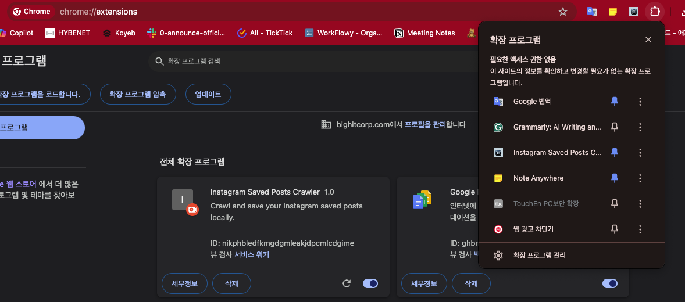
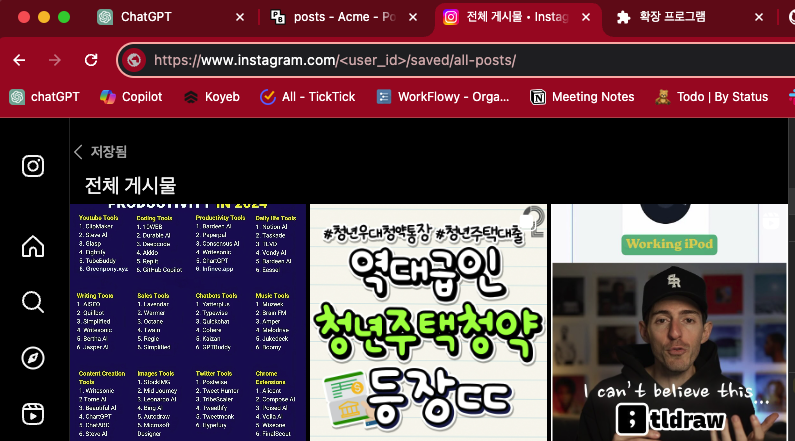
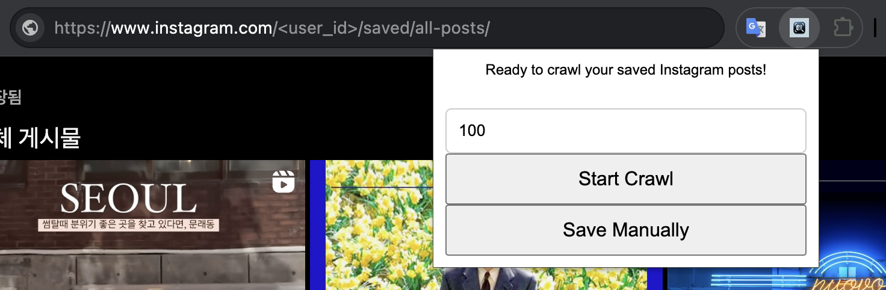

# insta_saved_posts_crawler

This project provides functionality to crawl and save Instagram saved posts.

## 1. Download repository as a zip file

---

## 2. unzip downloaded zip file like below

---

## 3. install chrome extension by loading unziped directory

### 3-1. access to `chrome://extensions/`

### 3-2. enable developer mode

### 3-3. install chrome extension

### 3-4. pin `Instagram Saved Posts Crawler` extension to top of the chrome

---

## 4. move to https://www.instagram.com/<user_id>/saved/all-posts/

-   you need to replace <user_id> to your instagram user id
  -   may you need to login to your instagram account
-   may you need to reload the page to apply the extension

---

## 5. set maximum number of posts you want to capture and click start

-   **Do not switch Chrome tabs during crawling. It may cause the crawling to stop.**
-   **If crawling ends before reaching the max value due to scrolling or internet issues, pressing the Start button again will resume crawling while keeping the previously saved data.**
-   **If you want to save intermediate results during crawling, press the SaveManually button to save the current results.**
-   **If the download window does not appear after scrolling is complete, please press the SaveManually button to save the results collected so far.**

---

# Question?

-   cmpark0126@gmail.com
