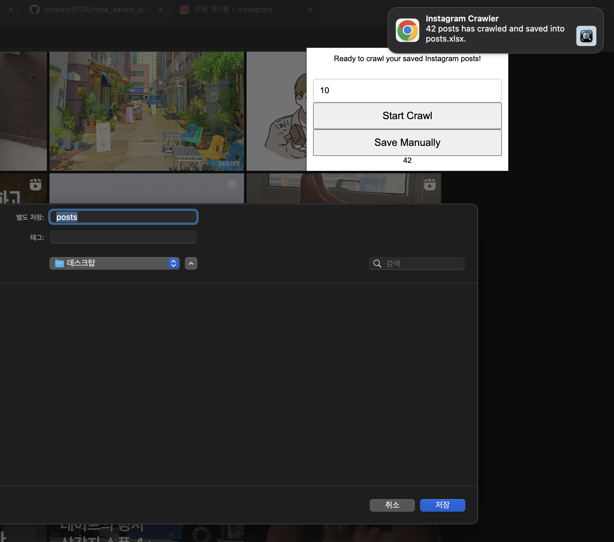
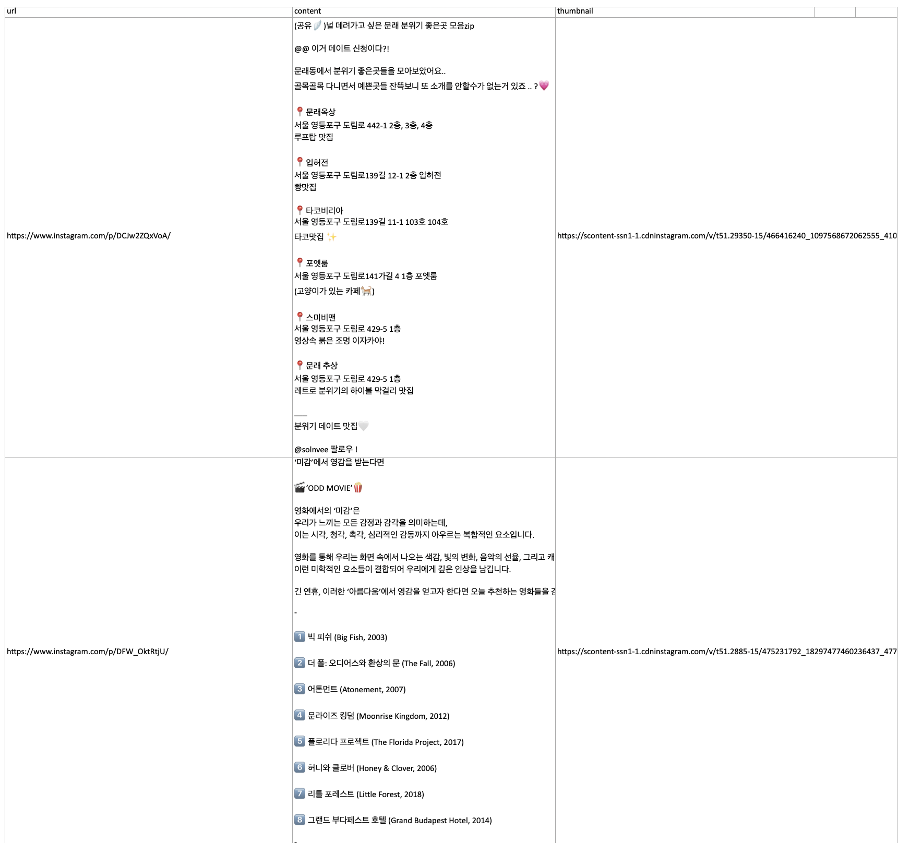

# insta_saved_posts_crawler

이 프로젝트는 인스타그램 저장된 포스트를 크롤링하고 저장하는 기능을 제공합니다.

## 1. 저장소를 zip 파일로 다운로드하기

---

## 2. 다운로드한 zip 파일을 아래와 같이 압축 해제하기

---

## 3. 압축 해제된 디렉토리로 크롬 확장 프로그램 설치하기

### 3-1. `chrome://extensions/`에 접근하기

### 3-2. 개발자 모드 활성화하기

### 3-3. 크롬 확장 프로그램 설치하기

### 3-4. 크롬 상단에 `Instagram Saved Posts Crawler` 확장 프로그램 고정하기

---

## 4. https://www.instagram.com/<user_id>/saved/all-posts/로 이동하기

-   <user_id>를 자신의 인스타그램 사용자 ID로 교체해야 합니다.
  -   인스타그램 계정에 로그인해야 할 수도 있습니다.
-   확장 프로그램을 적용하기 위해 페이지를 새로 고쳐야 할 수도 있습니다.

---

## 5. 캡처할 최대 포스트 수를 설정하고 시작 클릭하기

-   **크롤링 중에 크롬 탭을 전환하지 마세요. 크롤링이 중단될 수 있습니다.**
-   **스크롤링이나 인터넷 문제로 최대 값에 도달하기 전에 크롤링이 끝나면, 시작 버튼을 다시 눌러 이전에 저장된 데이터를 유지하면서 크롤링을 재개할 수 있습니다.**
-   **크롤링 중간 결과를 저장하고 싶다면, SaveManually 버튼을 눌러 현재 결과를 저장하세요.**
-   **스크롤이 완료된 후 다운로드 창이 나타나지 않으면, 지금까지 수집된 결과를 저장하기 위해 SaveManually 버튼을 눌러주세요.**

---

## 6. 크롤링 완료 후 포스트 목록을 엑셀 파일로 다운로드하기

-   크롤링이 완료되면 포스트 목록이 엑셀 파일 다운로드 창이 뜹니다.

---

## 알려진 문제

### 1. 오류: 연결을 설정할 수 없습니다. 수신 측이 존재하지 않습니다. 메시지
- **이 오류가 발생하면 인스타그램 페이지를 새로고침하세요. 페이지 진입 후에 확장 프로그램이 설치되면 페이지에 확장 프로그램이 제대로 이식되지 않아 제대로 동작하지 않습니다.**

### 2. 페이지 끝에서 크롤링이 멈추고 포스트가 저장되지 않음
- **크롤링을 위해 스크롤이 진행되다가 페이지 맨 끝에 다다르면 포스트를 크롤링한 내용이 저장되지 않고 멈추는 현상이 발생할 수 있습니다. 이때는 (1) 아래위로 수동으로 스크롤을 하면 곧 포스트 저장 팝업이 뜰겁니다. 크롬의 확장 프로그램이 마지막 액션 이후에 freeze되는 현상으로 인해 다음 단계로 넘어가지 않는 문제입니다. (2) 그래도 안 되면 save manually를 사용하세요. 그럼 지금까지 크롤링 한 내용이 저장될 겁니다.**

---

# 질문?

-   cmpark0126@gmail.com 